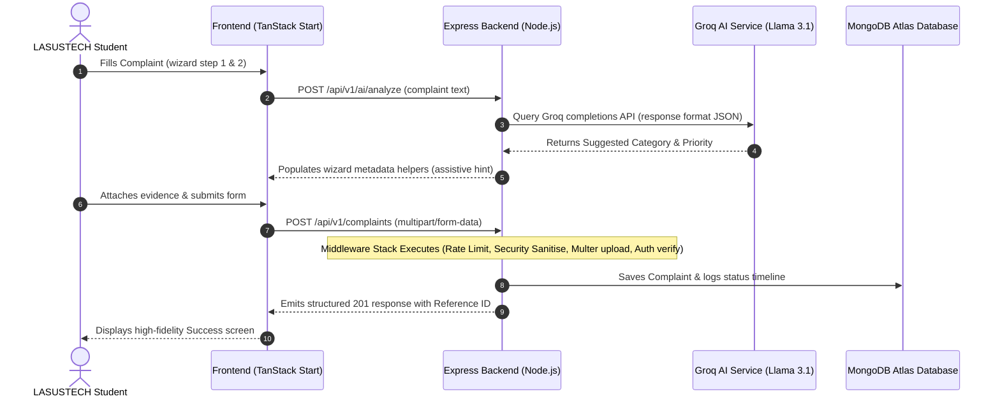
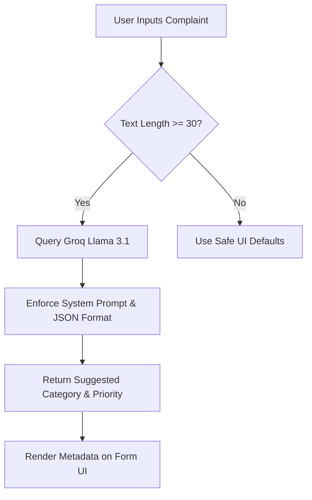

# LASUSTECH Student Resolution Center (Sentinel Portal)
## Comprehensive Technical Workflow, Middleware Deep-Dive, & Architectural Security Audit

---

## 1. End-to-End System Workflow

The Sentinel Portal operates as a highly coordinated full-stack web application. It connects the **TanStack Start (Vite + React) Frontend** with the **Express + Node.js Backend**, storing data persistently in a **MongoDB Atlas Cluster** (with MySQL preserved as a resilient fallback layer).



### A. Frontend Lifecycle
1. **Routing and Guarding:**
   - Powered by **TanStack Router**. Dynamic routes (e.g. `/dashboard/*`, `/admin/*`) use programmatic layout wrappers and route definitions.
   - Authentication checks verify the presence of `as_access_token` in `localStorage`. If missing or invalid, routes redirect to `/login`.
   - The Root Route (`routes/__root.tsx`) preloads global assets (Google Fonts: *Inter* and *Outfit*), styles, and mounts the **TanStack Query Client** provider and **Sonner Toaster** for seamless, non-blocking notification delivery.

2. **Server State Management:**
   - **TanStack Query** manages server state, providing automatic caching, caching invalidation, and data refetching when updating complaint lists.
   - The UI features micro-animations built with **Framer Motion** (e.g., transition animations during the 4-step report submission wizard).

3. **Complaint Submission Flow (`routes/submit.tsx`):**
   - **Step 1 (What happened):** Student selects from 9 curated categories (academic concern, hostel welfare, security, etc.) and specifies a department (Bursary, Registry, etc.) and priority level.
   - **Step 2 (Details):** Student describes the event. Once description length > 30 characters, the frontend queries the AI endpoint to suggest category and routing, providing an assistive real-time review.
   - **Step 3 (Evidence):** Drag-and-drop multi-file selection supporting JPG, PNG, WEBP, PDF, and DOCX (up to 5 files).
   - **Step 4 (Review & Privacy):** Student reviews their data and chooses whether to submit *anonymously* (stripping identify keys in backend query).
   - **Submission & Redirection:** FormData is posted to the backend. The student receives a unique reference ID (e.g., `CMP-171583901-A4F9`) and a copy-to-clipboard widget.

---

### B. Backend Request Lifecycle
1. **Entry Point & Connection Boot (`server.js`):**
   - Server initializes environment configs from `.env` via central `config.js`.
   - Connections to MongoDB Atlas are tested. If the MongoDB service is unreachable, the system triggers **Resilient Mode**, which prints a database warning but allows the Express server to start, serving static uploads and the Groq AI Chat Companion while failing non-essential requests gracefully.
   - Registers CORS rules, body parsers, input sanitizers, custom security headers, and assets routes (`/uploads`) before mounting main `/api/v1` routes.

2. **Route Handling & Controller Layer:**
   - Express routes are separated by domains (auth, complaints, departments, notifications, AI).
   - Controllers handle client input validation, wrap requests in an `asyncHandler` (forwarding any thrown errors downstream to the global error middleware), and invoke the specialized **Service Layer** for domain logic.
   - Success or failure is strictly framed using custom response helpers:
     - `sendSuccess(res, data, message, statusCode)`
     - `sendError(res, message, statusCode, errors)`

3. **Data Persistency & Model Layer:**
   - Mongoose schemas represent collection blueprints:
     - **`User`**: Dynamic role handling (`student`, `staff`, `admin`), nested notifications/theme preferences, and unique indexes on `matric` and sparse indexes on `email`.
     - **`Complaint`**: Highly structured document with embedded arrays for files, internal admin notes, and full history timelines.
     - **`SuspiciousActivity`**: Log collection for security events (e.g., rate limit hits) containing IP address, user agents, paths, and severity rankings.

---

## 2. Middleware Architecture

Every incoming request passes through a sequential middleware matrix before hitting controllers. This ensures high-performance sanitization, strict rate boundaries, role checking, and resilient file formatting.

```
Request → [CORS Check] → [Body Parsers] → [XSS Sanitiser] → [Security Headers] → [JWT Authenticator] → [Role Guard] → [Rate Limiter] → [Multer File Collector] → Controller
```

### 1. Cross-Origin Resource Sharing (CORS)
Configured to validate requests against a strict domain whitelist (including LASUSTECH official domain and local Vite ports: `5173`, `5174`, `5175`). It supports dynamic regex checking to permit Vercel preview deployments (`.vercel.app`) on the fly while restricting unauthorized origins.

### 2. XSS Input Sanitization (`middleware/security.middleware.js`)
Recursively traverses request payloads (`req.body`, `req.query`, and `req.params`) using the `xss` engine, stripping malicious scripts, HTML tags, or unescaped elements to defeat cross-site scripting attacks seamlessly.

### 3. HTTP Security Headers Injection (`server.js`)
Standardizes server response headers to prevent browser-side security exploits without needing extra third-party libraries:
- `X-Content-Type-Options: nosniff` (Defeats MIME-type sniffing)
- `X-Frame-Options: DENY` (Defeats Clickjacking)
- `X-XSS-Protection: 1; mode=block` (Enforces modern browser-level XSS behaviors)
- `Referrer-Policy: strict-origin-when-cross-origin` (Protects referrer data)

### 4. JWT Authentication Guard (`middleware/auth.middleware.js`)
- Parses request headers for Bearer tokens.
- Decodes and verifies the token signature against `JWT_SECRET`.
- Attaches the decoded user credentials (ID, Name, Role) to `req.user` for downstream access.
- Correctly parses expired tokens and issues explicit `TokenExpiredError` responses to prompt client-side token rotation.

### 5. Role Authorization (`middleware/auth.middleware.js`)
Re-usable closure-based guard executed directly after authentication.
- **Example:** `authorize('admin')` restricts endpoints like analytics or case reviews, throwing a structured `403 Forbidden` if unauthorized.

### 6. Complaint Submission Rate Limiter (`middleware/rateLimit.middleware.js`)
Protects backend endpoints from spam submissions.
- Queries the MongoDB collection for complaints submitted by the active `user.id` within a 60-minute window.
- If the threshold (e.g., max 3 per hour) is reached, it:
  1. Spawns an entry in the `SuspiciousActivity` model containing client IP, User-Agent, path, and severity set to `medium`.
  2. Blocks the request by throwing a `429 Too Many Requests` error.

### 7. File Collector and Sharp Compressor (`middleware/upload.middleware.js` & `services/file.service.js`)
- **Stage A (Multer):** Accepts up to 5 multipart attachments with the field name `files`, enforcing physical size limits (e.g., 5MB per file) and verifying MIME types (images, PDFs, DOCX). Raw files land temporarily in `uploads/raw/`.
- **Stage B (Sharp Processor):** The complaint service hands off the uploaded items to the `file.service.js`. Images undergo high-performance resizing (capped at 800px width, preserving aspect ratios) and are compressed to WebP/JPEG formats at high-efficiency quality scores (`80-82%`). Non-image files (PDFs, DOCX) are safely renamed and transferred to `uploads/compressed/` while original raw copies are cleaned up instantly from disk.

---

## 3. Silent Error Handling Mechanics

A major hallmark of this codebase is how it catches and manages errors that normally escape standard logging systems (so-called **"silent errors"**).

### A. The H3 SSR Silent Error Swallow Bypass
In full-stack architectures utilizing **Nitro / H3** servers, any runtime error thrown inside server-side rendering (SSR) or endpoint handlers is swallowed by the server engine, which then responds with a generic `500 Internal Server Error` containing a simple JSON payload:
```json
{"unhandled": true, "message": "HTTPError"}
```
This hides the actual stack trace, making debugging extremely difficult. Sentinel uses a custom, two-part out-of-band capture system to bypass this:

1. **Out-of-band Capture Listener (`frontend/src/lib/error-capture.ts`):**
   Registers global event listeners on the server context for `error` and `unhandledrejection`. When an error is thrown, the handler stores the full error stack in a transient `lastCapturedError` variable alongside a timestamp and a 5-second TTL:
   ```typescript
   if (typeof globalThis.addEventListener === "function") {
     globalThis.addEventListener("error", (event) => record((event as ErrorEvent).error ?? event));
     globalThis.addEventListener("unhandledrejection", (event) => record((event as PromiseRejectionEvent).reason));
   }
   ```

2. ** Catastrophic Response Inspector (`frontend/src/server.ts`):**
   The main server handler wraps the fetch promise and inspects the response status. If a status $\ge 500$ is encountered, and the payload matches the signature of a swallowed H3 SSR error, the server pulls the true error out-of-band using `consumeLastCapturedError()`, logs the detailed traceback to the server console, and returns a high-fidelity, branded HTML error page:
   ```typescript
   async function normalizeCatastrophicSsrResponse(response: Response): Promise<Response> {
     if (response.status < 500) return response;
     // ... check for exact JSON swallowed format ...
     const body = await response.clone().text();
     if (!isCatastrophicSsrErrorBody(body, response.status)) return response;
     console.error(consumeLastCapturedError() ?? new Error(`h3 swallowed SSR error: ${body}`));
     return brandedErrorResponse(); // Sends high-fidelity custom HTML error page
   }
   ```

### B. Backend Resilient Operations
- **Database Fallback:** If the primary MongoDB cluster times out, the backend gracefully continues executing rather than crashing the system, keeping public and stateless features (like the Groq AI Chat and general portal pages) active.
- **Upload Failure Cleanup:** If a database transaction or complaint record creation fails *after* Multer saves files, the service triggers `safeCleanRaw()`, which runs unlinks on all temp files to prevent disk leakages.

---

## 4. AI Intelligence Workflow

Sentinel integrates high-performance LLMs to provide real-time support and assistance, running via the custom Groq API service.



### A. Real-time Complaint Analysis (`POST /api/v1/ai/analyze`)
- Sent text is forwarded to Groq utilizing the **Llama 3.1 8B Instant** model.
- The service enforces a rigid system prompt with explicit classification categories and deterministic settings (temperature set to `0.3`).
- **Response Format:** A structured JSON object containing:
  ```json
  {
    "category": "academic-result",
    "priority": "high",
    "recommendation": "Brief assistive recommendation text..."
  }
  ```
- The results are displayed dynamically as an assistive card, helping students understand where their complaint will go before they submit it.

### B. Sentinel Advisor Companion Chat (`POST /api/v1/ai/chat`)
- A warm, friendly conversational companion called **SENTINEL ADVISOR**.
- **Rules Enforced at System Level:**
  1. **Strict Markdown Prohibition:** The agent strips all markdown formatting (bolding, headers, lists) automatically to guarantee clean, unformatted plain-text output that renders safely without UI parser breaks.
  2. **Warm Conversational Tone:** Uses natural language (not structured tables or lists) to sound like an empathetic senior student or mentor.
  3. **Direct Escalation:** Acknowledges student frustration and gently recommends the formal **"Launch Report"** wizard if the matter is highly critical.

---

## 5. System Security & Architecture Audit Report

This section outlines a high-fidelity audit of the system’s components, rating them by robustness and identifying potential security optimizations.

### Component Robustness Audit

| System Area | Audit Rating | Strengths | Observations & Recommendations |
| :--- | :--- | :--- | :--- |
| **Authentication** | 🟢 **Excellent** | Strong JWT access/refresh token partition. Stateless token verification. Clear TokenExpiredError signaling. | Ensure that refresh tokens are safely stored in HTTP-only cookies on production environments to defeat token theft via XSS. |
| **Input Validation** | 🟢 **Excellent** | Validation rules are written in lightweight vanilla modules, avoiding unnecessary dependencies. Fields are strictly constrained. | Add rate limits directly to register and login routes to deter brute-force credential stuffing. |
| **Security Hardening** | 🟢 **Excellent** | Recursive `xss` body sanitization combined with strict security headers (Nosniff, Clickjacking denial). Whitelisted CORS origins. | Consider integrating a Web Application Firewall (WAF) or IP bans on repeated suspicious activity logs. |
| **Storage & Files** | 🟡 **Very Good** | Multer file limits, MIME validations. Sharp resizing to 800px & high-quality compression saves enormous disk storage. Cleanups run on failed DB submissions. | Add virus scanning utilities (e.g. ClamAV) in the upload stream to prevent malicious PDF/Docx payloads from landing on the host system. |
| **Error Handling** | 🟢 **Excellent** | Superb out-of-band recovery system for swallowed Nitro/H3 server exceptions. Elegant custom HTML fallbacks. | Ensure stack trace logging is completely silenced on production builds to avoid exposing internal directory patterns. |
| **AI Integration** | 🟢 **Excellent** | Clean JSON formatting using deterministic parameters. Empathetic plain-text chat rules prevent parser breaks. | Set up caching or local storage for chat history to minimize Groq API request overhead. |

---

### Key Recommendations for Production Readiness
1. **Cookie-Based Token Storage:** Move JWTs from localStorage to secure `HttpOnly`, `Secure`, and `SameSite=Strict` cookies.
2. **Scan Uploaded Evidence:** Integrate file validation that scans document attachments to guarantee they are safe.
3. **Database Indexing:** Ensure indices exist on the Mongoose models for `reference_id` and `user_id` to guarantee fast retrieval as document volumes scale.
4. **Log Truncation:** Implement automatic cleanup scripts to archive ancient `SuspiciousActivity` entries periodically.
